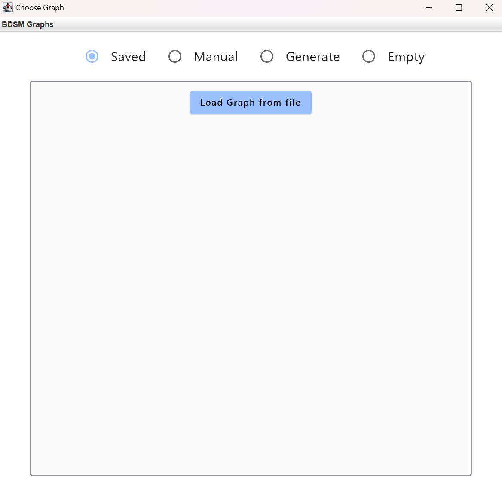
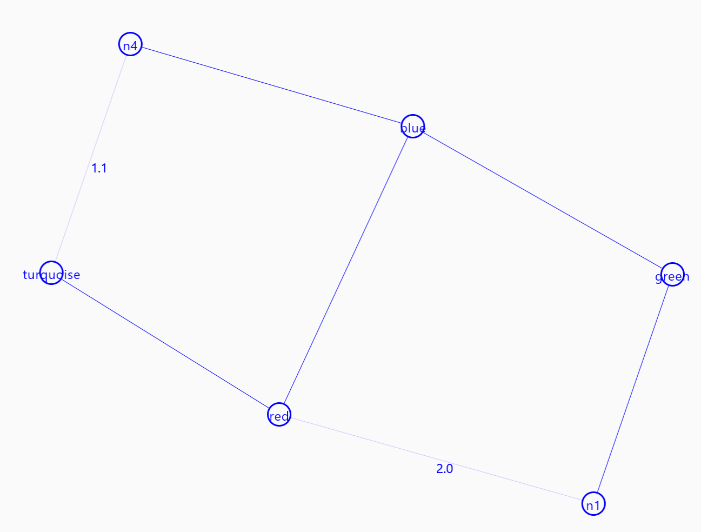
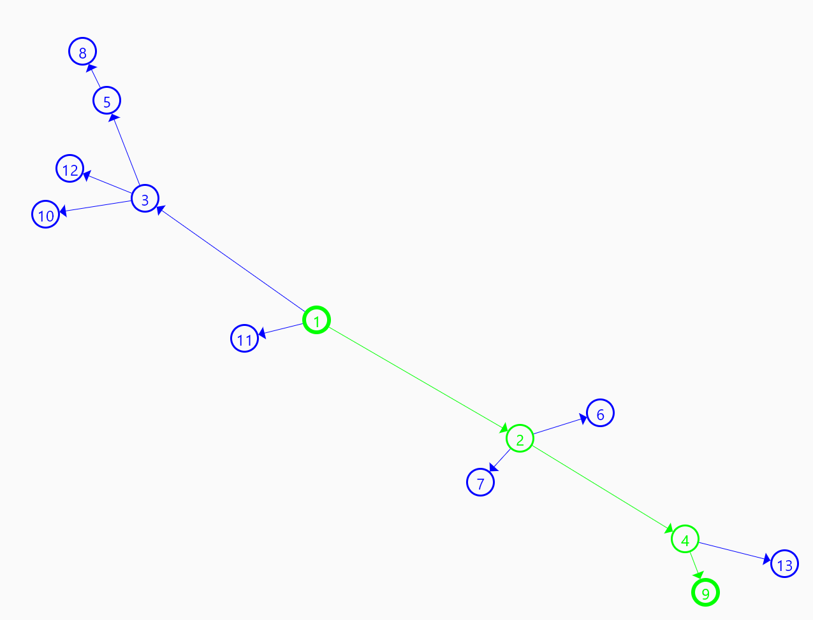
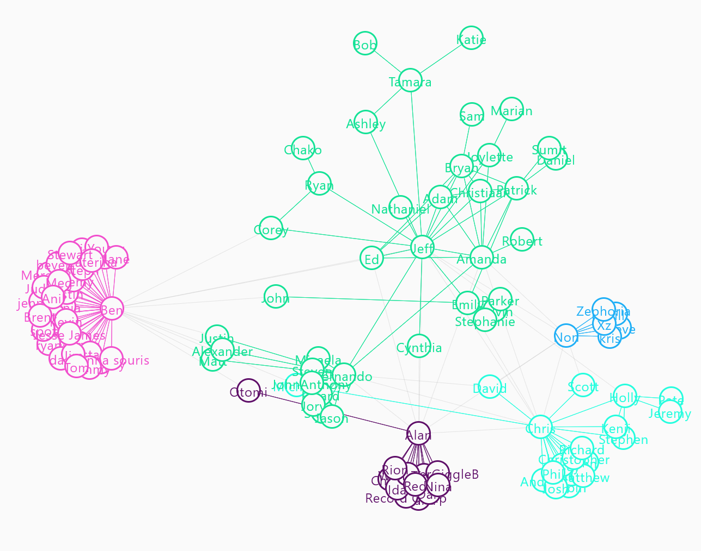

<h1 align="center">BDSM graphs</h1>

## Создано с использованием

- [Kotlin 1.9.22](https://kotlinlang.org/)
- [JDK 21.0.2](https://www.oracle.com/java/technologies/javase/21-0-2-relnotes.html)
- [Gradle 8.7](https://gradle.org/install/)
- [Compose for Desktop 1.6.2](https://github.com/JetBrains/compose-multiplatform): Для разработки графического пользовательского интерфейса.
- [compose-multiplatform-file-picker 3.1.0](https://github.com/Wavesonics/compose-multiplatform-file-picker): Для загрузки данных из файлов
- [gephi-toolkit 0.10.1](https://github.com/gephi/gephi-toolkit): Алгоритм раскладки графа

## О проекте

Добро пожаловать в приложение Graphs Team 11. Этот проект создан для анализа графов,
а так же для создания и генерации графов в обучающих целях. В проекте возможно сохранение данных
в базу данных SQLite3, либо же в файлы формата graphML.

### Алгоритмы доступные в проекте:
1. [ForceAtlas(2014)](https://journals.plos.org/plosone/article?id=10.1371/journal.pone.0098679) для раскладки графа
2. [Leiden algoritm(2019)](https://www.ultipa.com/document/ultipa-graph-analytics-algorithms/leiden/v4.3#:~:text=Return%20%E2%9C%93%20Stats-,Overview,well%2Dconnected%20or%20even%20disconnected.) для поиска сообществ
3. [Алгоритм поска мостов](http://e-maxx.ru/algo/bridge_searching)
4. [Алгоритм Дейсктры](http://e-maxx.ru/algo/dijkstra) для поиска пути
5. [Алгоритм Косараджу](https://ru.wikipedia.org/wiki/%D0%90%D0%BB%D0%B3%D0%BE%D1%80%D0%B8%D1%82%D0%BC_%D0%9A%D0%BE%D1%81%D0%B0%D1%80%D0%B0%D0%B9%D1%8E) для поиска компонент сильной связности
6. [Алгоритм Краскала](https://ru.wikipedia.org/wiki/%D0%90%D0%BB%D0%B3%D0%BE%D1%80%D0%B8%D1%82%D0%BC_%D0%9A%D1%80%D0%B0%D1%81%D0%BA%D0%B0%D0%BB%D0%B0) для поиска минимального остовного дерева

## Как пользоватся

### Экран загрузки графа

При запуске вы увидите главный экран.

Здесь вы можете выбрать один из 4 методов первоначальной загрузки графа:
1. Saved - загрузить файл из файла (что видно на фото), либо выбрать один из сохранённых в базе данных
2. Manual - после выбора размера графа, сгенерирует граф с выбранным числом вершин без рёбер.
3. Generate - позволяет воспользоваться одим из 4 генераторов: Случайное дерево, направленная и ненаправленная звезда и [Flower Snark](https://mathworld.wolfram.com/FlowerSnark.html)
4. Empty - Пустой граф.

### Главный экран

После выбора графов вы увидите главный экран.

### Управление

1. Движение вершин - зажав вершину левой кнопкой мыши и двигайте, куда вам надо. Если же вам надо двигать весь экран, то зажмите любое место, где нет вершины
2. Создание вершин - правая кнопка мыши. Чтобы создать ребро, выберите две ноды, и от первой до второй будет проведено ребро
3. Выбрать вершину - левая кнопка мыши по вершине
4. Приближение/Отдаление - колёсико мыши
5. Откатить изменение после алгоритма - Сtrl+z

### Меню слева

Отсюда вы можете запускать алгоритмы, а также косметически менять вид графа(пока только цвет всех вершин).

Рассмотрим несколько примеров:
1. Алгоритм поиска мининального основного дерева;
   
2. Алгоритм Поска пути. Для его запуска необходимо выбрать две вершины;
   
3. Алгоритм Поиска Сообществ.
   

## Лицензия

Распространяется по лицензии GNU GPLv3. См. файл `LICENSE.txt` для получения дополнительной информации.

## Авторы

- [AlexandrKudrya](https://github.com/AlexandrKudrya)
- [7gambit7](https://github.com/7gambit7)
- [VersusXX](https://github.com/VersusXX)

[license-shield]: https://img.shields.io/github/license/othneildrew/Best-README-Template.svg?style=for-the-badge:
[license-url]: https://github.com/spbu-coding-2023/trees-11/blob/main/LICENSE.txt